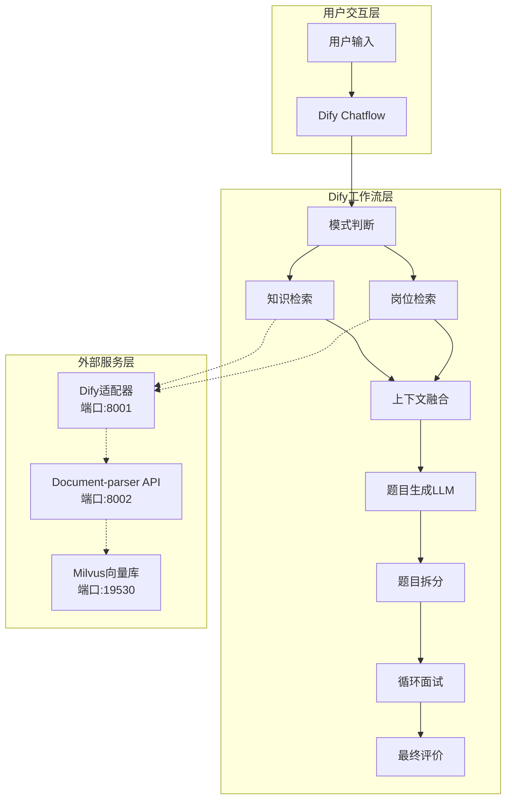
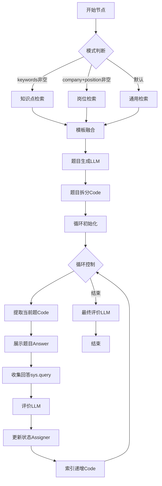
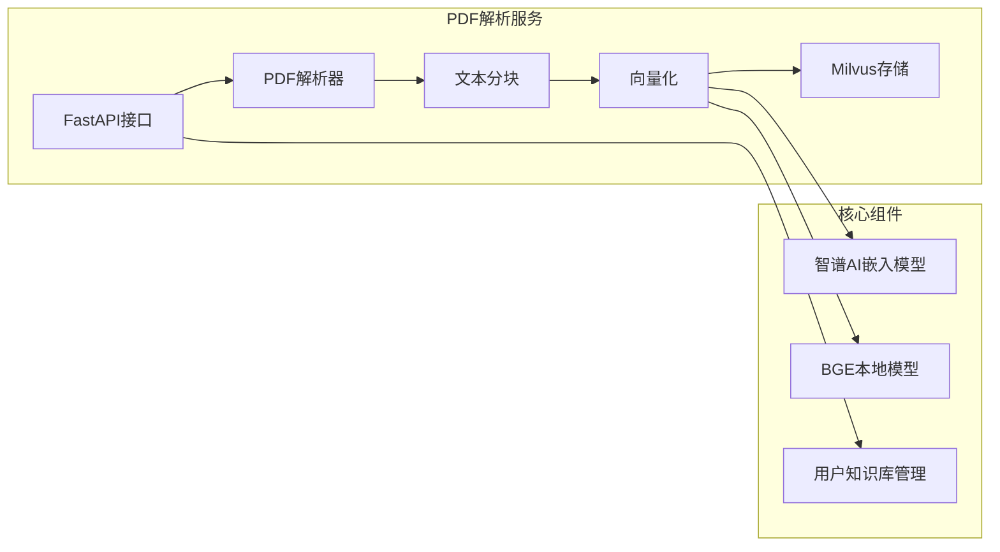
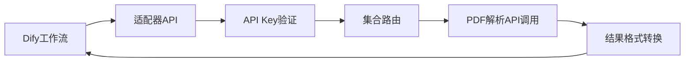
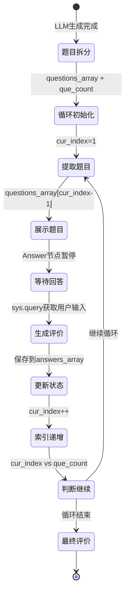
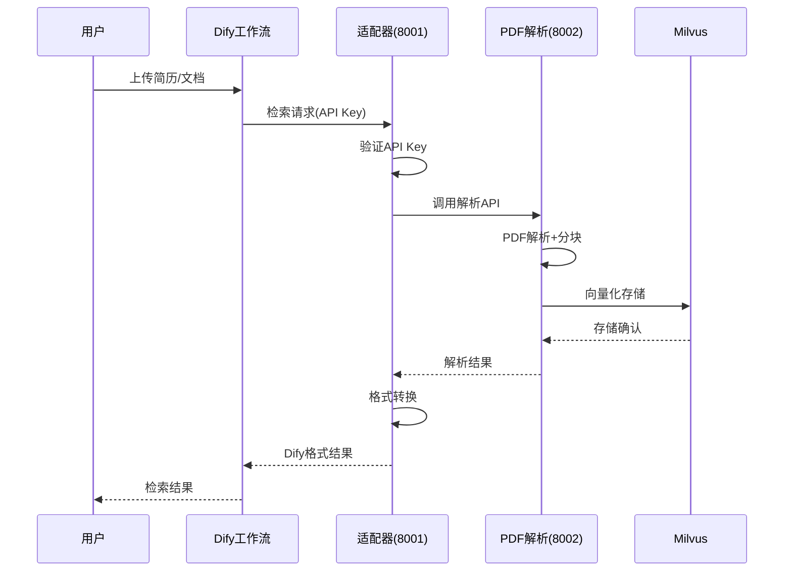

我来查看相关文件，重新撰写一份聚焦架构和技术思路的项目汇报。

# AI面试官智能体项目汇报

## 项目架构概览

本项目采用分层架构设计，由Dify Chatflow前端和外部知识库服务后端组成，实现智能化面试流程。



## 核心模块设计

### 1. Dify Chatflow工作流

#### 主要节点流程


#### 对话变量状态管理
```yaml
conversation_variables:
  - questions_array: array[string]  # 题目数组
  - que_count: integer             # 题目总数
  - cur_index: integer             # 当前题号(1开始)
  - last_question: string          # 上一题内容
  - answers_array: array[string]   # 用户回答历史
```

### 2. 外部知识库服务架构

#### Document-parser服务 (端口8002)


**技术栈**：
- **API框架**：FastAPI + Uvicorn
- **PDF解析**：PyPDFLoader
- **向量化**：智谱AI embedding-2 / BGE-small-zh-v1.5
- **向量存储**：Milvus 2.4+
- **文本分块**：RecursiveCharacterTextSplitter

#### Dify适配器服务 (端口8001)


**核心功能**：
- API Key到Milvus集合的映射
- Dify检索格式适配
- 用户知识库隔离
- 请求频率限制

## 关键技术实现

### 1. 知识库检索机制

#### 双路检索策略
```python
# 知识点检索路径
keywords → 知识点检索节点 → Milvus集合查询 → Top-K=4结果

# 岗位检索路径  
company_name + position → 模板拼接 → 岗位检索节点 → Milvus集合查询 → Top-K=4结果

# 结果融合
两路结果 → Jinja2模板 → 统一上下文文本 → LLM题目生成
```

#### 检索配置
- **重排序**：weighted_score模式，向量权重0.7，关键词权重0.3
- **Top-K**：4条最相关结果
- **嵌入模型**：智谱AI embedding-2 (1024维)

### 2. 循环面试实现机制

#### 状态机设计


#### 核心代码节点
```python
# 题目拆分器 (Code节点)
def main(questions_text: str) -> dict:
    lines = questions_text.strip().split('\n')
    questions = [line.split('：', 1)[1].strip() 
                for line in lines if '题：' in line]
    return {"questions_array": questions, "total_count": len(questions)}

# 题目提取器 (Code节点)  
def main(questions_array: list, current_index: int) -> dict:
    question_index = current_index - 1
    return {"current_question": questions_array[question_index]}

# 索引递增器 (Code节点)
def main(current_index: int) -> dict:
    return {"next_index": current_index + 1}
```

### 3. 外部知识库集成

#### 用户知识库管理
```python
# 用户ID到集合的映射
user_id: "user123" → collection: "user_kb_user123" → api_key: "dify-user-user123"

# API Key权限控制
{
  "dify-user-user123": {
    "collection": "user_kb_user123",
    "permissions": ["read"],
    "rate_limit": 100,
    "user_id": "user123"
  }
}
```

#### 文档处理流程


## 项目进度与待完成内容

### ✅ 已完成 (90%)
- **核心面试流程**：模式判断、知识检索、题目生成、循环问答
- **状态管理**：对话变量、循环控制、历史记录
- **外部服务**：PDF解析API、Dify适配器、Milvus集成
- **用户知识库**：个人文档管理、API Key隔离

### 🔄 待完成 (10%)
- **综合评价报告**：基于answers_array生成最终评价
- **错题分析**：低分题目整理和复习建议
- **导出功能**：面试记录PDF报告生成

### 🔧 优化方向
1. **RAGFlow迁移**：将Document-parser替换为RAGFlow，提升文档解析质量
2. **检索优化**：调整Top-K、重排权重，提升题目相关性
3. **评价算法**：多维度评分体系，个性化反馈机制

## 技术特点总结

1. **Chatflow状态管理**：巧妙利用对话变量实现复杂循环逻辑
2. **双路检索融合**：知识点+岗位检索，提升题目定制化程度  
3. **微服务架构**：PDF解析、适配器、向量库分离，便于扩展
4. **用户隔离**：基于API Key的多租户知识库管理
5. **可视化配置**：纯Dify节点实现，无需编程即可调整流程

该项目成功实现了智能面试的核心功能，在技术架构上具有良好的扩展性，为后续功能迭代提供了坚实基础。