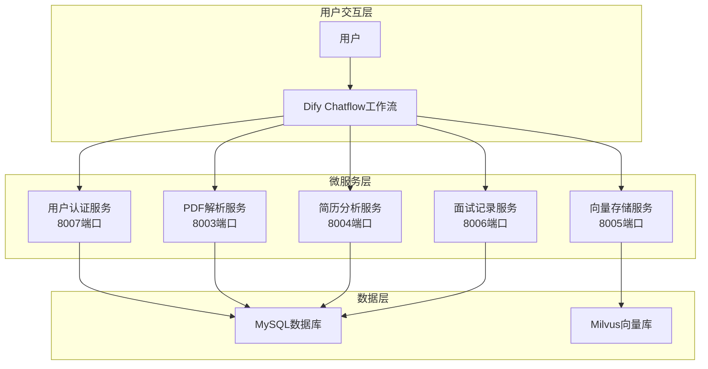
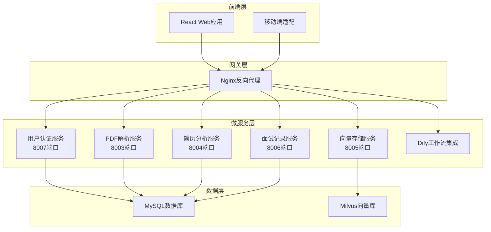
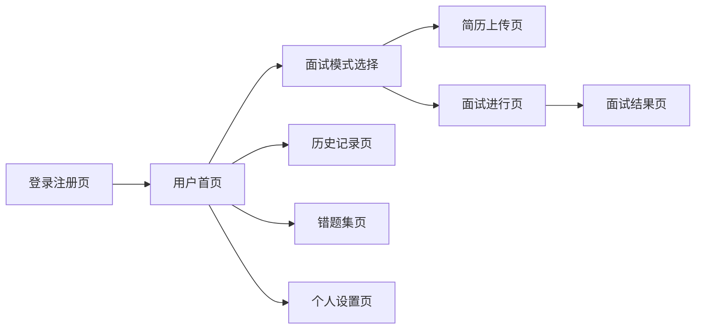
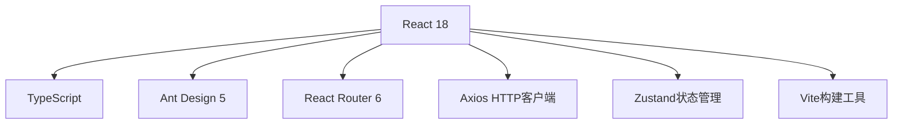
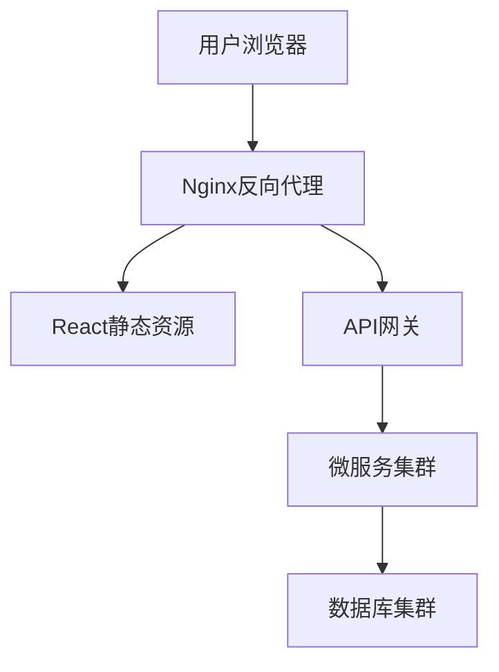
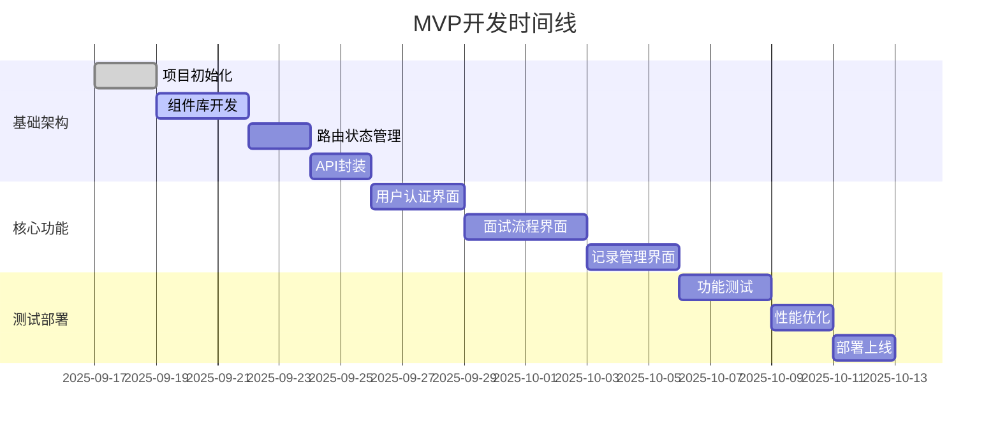

# 智能面试智能体项目需求分析与MVP设计规划

**更新时间**: 2025-01-17
**项目**: GUET-InduEdu 智能面试智能体系统
**规划类型**: 长期发展规划（MVP + 多阶段演进）
**文档状态**: Plan阶段 - 详细计划制定

## 1 项目概述

### 1.1 项目背景
基于桂林电子科技大学产教融合项目，构建"一企一面"的企业AI面试官智能体系统，为求职者提供个性化、智能化的面试练习平台。

### 1.2 现状分析
- **技术基础**：微服务架构 + Dify工作流，技术栈现代化
- **完成度**：核心功能完成大半，包含5个微服务（外部）和完整面试流程（dify）
- **主要缺口**：前端用户界面、基础管理功能

### 1.3 核心价值定位
- **目标用户**：求职准备的大学生和职场新人
- **核心价值**：个性化面试练习，AI驱动的能力提升
- **差异化优势**：简历定制面试 + 错题集强化 + 多模式面试

## 2 四阶段发展规划

### 2.1 阶段一：MVP快速上线 (4-6周)
**目标**：验证核心价值，提供完整用户体验

**核心功能**：
- ✅ 保持现有后端服务不变
- 🆕 开发Web前端界面 (React + Ant Design)
- 🆕 用户注册登录流程
- 🆕 面试流程用户引导
- 🆕 面试记录查看和管理

**验收标准**：
- 用户可以完整体验智能面试流程
- 界面友好，操作流畅
- 支持简历上传和定制面试
- 错题集功能可正常使用

### 2.2 阶段二：功能完善 (4-6周)
**目标**：完善基础功能，提升用户体验

**新增功能**：
- 🆕 面试数据统计和可视化
- 🆕 学习进度跟踪
- 🆕 面试记录导出功能
- 🆕 用户反馈和建议收集
- 🆕 基础的内容管理

**技术优化**：
- 性能优化和缓存机制
- 移动端响应式适配
- 用户体验优化

### 2.3 阶段三：管理功能 (4-6周)
**目标**：支持系统运营和管理

**管理功能**：

- 🆕 管理员后台系统
- 🆕 用户管理和数据统计
- 🆕 系统监控和日志管理
- 🆕 内容审核和管理工具

**数据分析**：
- 用户行为分析
- 面试效果评估
- 系统使用统计

### 2.4 阶段四：高级功能 (6-8周)
**目标**：差异化功能，提升竞争力

**可选功能**：
- 🆕 语音面试基础功能
- 🆕 企业定制题库
- 🆕 批量用户管理
- 🆕 API接口开放

## 3 需求分析

### 3.1 功能需求优先级

**P0 (必须有)**：
- 智能面试对话系统 ✅
- 简历解析和定制面试 ✅
- 面试记录和反馈 ✅
- 错题集和复习功能 ✅
- Web用户界面 ✅
- 多种面试模式选择 ✅

**P1 (应该有)**：

- 学习进度跟踪 🔄
- 基础数据统计 ❌
- 移动端适配 ❌

**P2 (可以有)**：
- 管理员后台 ❌
- 数据分析功能 ❌
- 用户反馈系统 ❌

**P3 (未来扩展)**：
- 语音面试功能
- 企业定制服务
- 第三方集成

### 3.2 系统架构分析

#### 3.2.1 现有技术架构

#### 3.2.2 目标架构 (MVP)

## 4 MVP功能设计

### 4.1 前端功能模块

#### 4.1.1 核心页面设计

#### 4.1.2 功能模块详细设计

**4.1.2.1 用户认证模块**
- 用户注册/登录界面
- JWT token管理
- 个人信息维护
- 密码修改功能

**4.1.2.2 面试核心模块**
- 面试模式选择 (简历定制/公司题库/知识点)
- 简历上传和解析状态显示
- 实时面试对话界面
- 面试进度显示

**4.1.2.3 学习管理模块**
- 面试历史记录列表
- 错题集查看和筛选
- 学习进度统计图表
- 面试报告导出

**4.1.2.4 系统设置模块**
- 主题切换 (亮色/暗色)
- 个人偏好设置
- 帮助文档
- 反馈建议

### 4.2 技术实现方案

#### 4.2.1 前端技术栈

#### 4.2.2 API集成方案
- 统一API客户端封装
- 请求/响应拦截器
- 错误处理和重试机制
- 接口缓存策略

#### 4.2.3 部署架构

## 5 开发实施计划

### 5.1 MVP开发计划 (4-6周)

#### 5.1.1 开发时间线

#### 5.1.2 开发任务分解
**Week 1-2: 基础设施**
- React + TypeScript项目搭建
- Ant Design组件库集成
- 路由和状态管理配置
- API客户端封装和测试

**Week 3-4: 核心功能**
- 用户认证页面开发
- 面试流程界面实现
- 历史记录和错题集页面
- 响应式布局适配

**Week 5-6: 完善优化**
- 功能测试和bug修复
- 性能优化和缓存策略
- 部署配置和上线

### 5.2 技术选型说明

#### 5.2.1 前端技术栈选择理由
- **React 18**: 成熟稳定，生态丰富，团队熟悉度高
- **TypeScript**: 类型安全，提升代码质量和维护性
- **Ant Design 5**: 企业级UI组件库，开发效率高
- **Vite**: 快速构建工具，开发体验好
- **Zustand**: 轻量级状态管理，学习成本低

#### 5.2.2 部署方案
- **前端**: Nginx静态资源服务
- **API网关**: Nginx反向代理
- **后端**: 复用现有微服务架构
- **数据库**: 复用现有MySQL + Milvus

## 6 验收标准

### 6.1 功能验收标准
- ✅ 用户可以正常注册登录
- ✅ 面试流程完整可用
- ✅ 简历上传和解析正常
- ✅ 错题集功能可正常使用
- ✅ 界面响应式适配良好
- ✅ 主要浏览器兼容性良好

### 6.2 用户体验标准
- 界面简洁直观，操作流程清晰
- 错误提示友好，帮助信息完善
- 支持主流浏览器和移动设备
- 用户满意度评分 > 4.0/5.0

---

**文档状态**: ✅ 详细计划制定完成  

**下一阶段**: Execute（执行）- 按计划实施开发  

**模块负责人**:徐泽坤 

**最后更新**: 2025-01-17
